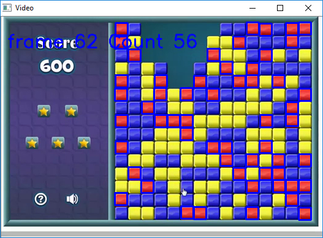

# blob_color_detection
A simple color blob detector using OpenCV 3.1 and Python 

Here are some of the snapshots
Identify color you want to detect in this window and confirm by pressing c

Snapshot of a frame from a game 

